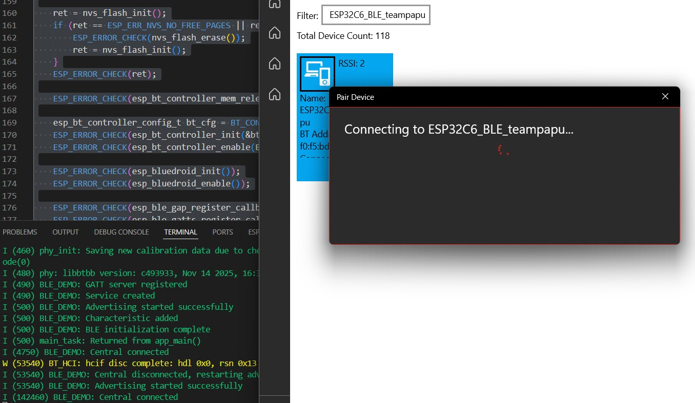
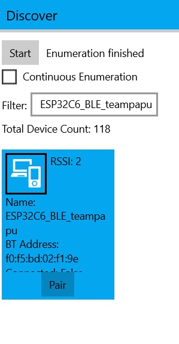
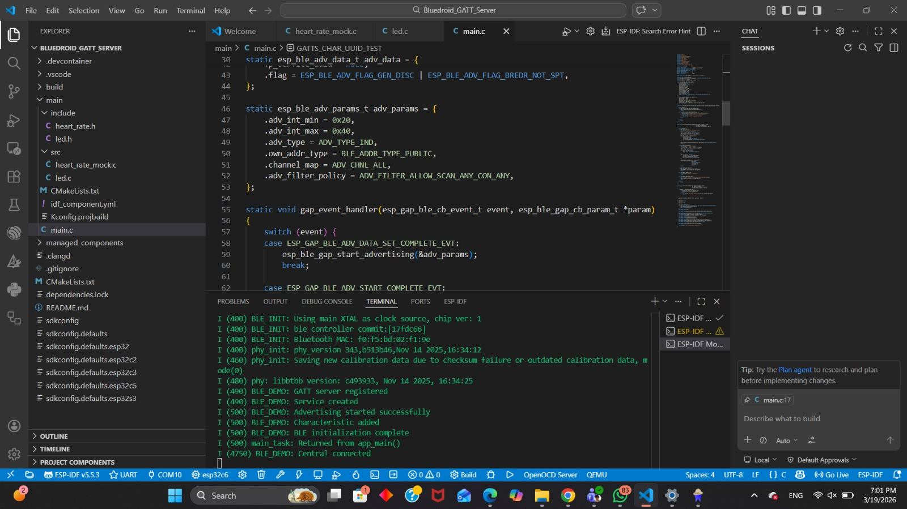

# Technical Log: BLE Configuration on ESP32-C6

## Team 
* Yahir Gil Mendoza
* Isaac Antonio Perez Aleman
* Pablo Eduardo López Manzano

---

## 1) Lab Procedure & Verification Checkpoints

During this laboratory, the following procedure was successfully executed and verified:
* Flashed the ESP-IDF project with the complete code to the ESP32-C6.
* Verified correct boot and BLE initialization without errors via the serial monitor.
* Confirmed that advertising started successfully.
* Used **Bluetooth LE Explorer** on a Windows PC to scan and discover the device named `ESP32C6_BLE_DEMO`.
* Located the custom service with `UUID 0x00FF`.
* Located the characteristic with `UUID 0xFF01` inside the custom service.
* Successfully executed a **Read** action on the characteristic, confirming the payload value: `"Hello from ESP32-C6"`.

---

``
#include <stdio.h>
#include <string.h>
#include "freertos/FreeRTOS.h"
#include "freertos/task.h"
#include "esp_log.h"
#include "nvs_flash.h"
#include "esp_bt.h"
#include "esp_gap_ble_api.h"
#include "esp_gatts_api.h"
#include "esp_bt_main.h"
#include "esp_gatt_common_api.h"

static const char *TAG = "BLE_DEMO";

#define DEVICE_NAME              "ESP32C6_BLE_teampapu"
#define GATTS_SERVICE_UUID_TEST  0x00FF
#define GATTS_CHAR_UUID_TEST     0xFF01
#define GATTS_NUM_HANDLE_TEST    4
#define PROFILE_NUM              1
#define PROFILE_APP_IDX          0
#define ESP_APP_ID               0x55

static const char char_value[] = "Hello world, i'm hungry!";

static uint16_t service_handle;
static esp_gatt_char_prop_t char_property = ESP_GATT_CHAR_PROP_BIT_READ;
static uint16_t char_handle;
static esp_gatt_if_t gatts_if_for_profile = 0;

static esp_ble_adv_data_t adv_data = {
    .set_scan_rsp = false,
    .include_name = true,
    .include_txpower = false,
    .min_interval = 0x20,
    .max_interval = 0x40,
    .appearance = 0x00,
    .manufacturer_len = 0,
    .p_manufacturer_data = NULL,
    .service_data_len = 0,
    .p_service_data = NULL,
    .service_uuid_len = 0,
    .p_service_uuid = NULL,
    .flag = ESP_BLE_ADV_FLAG_GEN_DISC | ESP_BLE_ADV_FLAG_BREDR_NOT_SPT,
};

static esp_ble_adv_params_t adv_params = {
    .adv_int_min = 0x20,
    .adv_int_max = 0x40,
    .adv_type = ADV_TYPE_IND,
    .own_addr_type = BLE_ADDR_TYPE_PUBLIC,
    .channel_map = ADV_CHNL_ALL,
    .adv_filter_policy = ADV_FILTER_ALLOW_SCAN_ANY_CON_ANY,
};

static void gap_event_handler(esp_gap_ble_cb_event_t event, esp_ble_gap_cb_param_t *param)
{
    switch (event) {
    case ESP_GAP_BLE_ADV_DATA_SET_COMPLETE_EVT:
        esp_ble_gap_start_advertising(&adv_params);
        break;

    case ESP_GAP_BLE_ADV_START_COMPLETE_EVT:
        if (param->adv_start_cmpl.status == ESP_BT_STATUS_SUCCESS) {
            ESP_LOGI(TAG, "Advertising started successfully");
        } else {
            ESP_LOGE(TAG, "Advertising start failed");
        }
        break;

    default:
        break;
    }
}

static void gatts_profile_event_handler(esp_gatts_cb_event_t event,
                                        esp_gatt_if_t gatts_if,
                                        esp_ble_gatts_cb_param_t *param)
{
    switch (event) {
    case ESP_GATTS_REG_EVT:
        ESP_LOGI(TAG, "GATT server registered");
        gatts_if_for_profile = gatts_if;

        esp_ble_gap_set_device_name(DEVICE_NAME);
        esp_ble_gap_config_adv_data(&adv_data);

        esp_gatt_srvc_id_t service_id = {
            .is_primary = true,
            .id.inst_id = 0x00,
            .id.uuid.len = ESP_UUID_LEN_16,
            .id.uuid.uuid.uuid16 = GATTS_SERVICE_UUID_TEST,
        };

        esp_ble_gatts_create_service(gatts_if, &service_id, GATTS_NUM_HANDLE_TEST);
        break;

    case ESP_GATTS_CREATE_EVT:
        ESP_LOGI(TAG, "Service created");
        service_handle = param->create.service_handle;
        esp_ble_gatts_start_service(service_handle);

        esp_bt_uuid_t char_uuid = {
            .len = ESP_UUID_LEN_16,
            .uuid.uuid16 = GATTS_CHAR_UUID_TEST,
        };

        esp_attr_value_t char_val = {
            .attr_max_len = sizeof(char_value),
            .attr_len = strlen(char_value),
            .attr_value = (uint8_t *)char_value,
        };

        esp_ble_gatts_add_char(service_handle,
                               &char_uuid,
                               ESP_GATT_PERM_READ,
                               char_property,
                               &char_val,
                               NULL);
        break;

    case ESP_GATTS_ADD_CHAR_EVT:
        ESP_LOGI(TAG, "Characteristic added");
        char_handle = param->add_char.attr_handle;
        break;

    case ESP_GATTS_CONNECT_EVT:
        ESP_LOGI(TAG, "Central connected");
        break;

    case ESP_GATTS_DISCONNECT_EVT:
        ESP_LOGI(TAG, "Central disconnected, restarting advertising");
        esp_ble_gap_start_advertising(&adv_params);
        break;

    default:
        break;
    }
}

static void gatts_event_handler(esp_gatts_cb_event_t event,
                                esp_gatt_if_t gatts_if,
                                esp_ble_gatts_cb_param_t *param)
{
    if (event == ESP_GATTS_REG_EVT) {
        if (param->reg.status == ESP_GATT_OK) {
            gatts_if_for_profile = gatts_if;
        } else {
            ESP_LOGE(TAG, "GATT app register failed: %d", param->reg.status);
            return;
        }
    }

    gatts_profile_event_handler(event, gatts_if, param);
}

void app_main(void)
{
    esp_err_t ret;

    ret = nvs_flash_init();
    if (ret == ESP_ERR_NVS_NO_FREE_PAGES || ret == ESP_ERR_NVS_NEW_VERSION_FOUND) {
        ESP_ERROR_CHECK(nvs_flash_erase());
        ret = nvs_flash_init();
    }
    ESP_ERROR_CHECK(ret);

    ESP_ERROR_CHECK(esp_bt_controller_mem_release(ESP_BT_MODE_CLASSIC_BT));

    esp_bt_controller_config_t bt_cfg = BT_CONTROLLER_INIT_CONFIG_DEFAULT();
    ESP_ERROR_CHECK(esp_bt_controller_init(&bt_cfg));
    ESP_ERROR_CHECK(esp_bt_controller_enable(ESP_BT_MODE_BLE));

    ESP_ERROR_CHECK(esp_bluedroid_init());
    ESP_ERROR_CHECK(esp_bluedroid_enable());

    ESP_ERROR_CHECK(esp_ble_gap_register_callback(gap_event_handler));
    ESP_ERROR_CHECK(esp_ble_gatts_register_callback(gatts_event_handler));
    ESP_ERROR_CHECK(esp_ble_gatts_app_register(ESP_APP_ID));

    ESP_ERROR_CHECK(esp_ble_gatt_set_local_mtu(500));

    ESP_LOGI(TAG, "BLE initialization complete");
}
``

## 2) Evidence Required (Screenshots)

### 2.1 Serial Monitor (BLE Startup)
*Log showing BLE initialization and advertising messages upon boot.*

### 2.2 Windows PC Discovery
*Bluetooth LE Explorer showing the discovered `ESP32C6_BLE_DEMO` device in the scan list.*

### 2.3 Service and Characteristic
*Explorer interface displaying the custom service (`0x00FF`) and characteristic (`0xFF01`).*

---

## 3) Technical Explanations

**What is the difference between a central and a peripheral?**
* A **Peripheral** device advertises its presence and provides data or services to others (in this lab, our ESP32-C6 acting as the data provider). 
* A **Central** device scans for advertising peripherals, initiates connections, and reads/writes the data (in this lab, the Windows PC running Bluetooth LE Explorer).

**What is the difference between a service and a characteristic?**
* A **Service** is a logical container or collection of related data and behaviors (think of it as a folder). For example, a "Heart Rate Service". In our lab, this is UUID `0x00FF`.
* A **Characteristic** is the actual data point within that service (think of it as a specific file inside the folder) that can be read, written to, or notified. In our lab, UUID `0xFF01` is the characteristic holding the string value.

**Why is BLE suitable for this type of application?**
* BLE (Bluetooth Low Energy) is specifically optimized for very low power consumption. It is ideal for IoT devices (like the ESP32) because it allows them to run on batteries for long periods while periodically transmitting small amounts of data (like sensor readings, state changes, or short messages) without the heavy energy overhead of Wi-Fi or Classic Bluetooth.